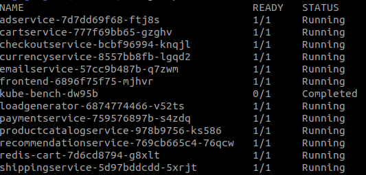

# Vagrant Ansible Terraform Kubernetes Cluster

This project allows you to create a K8s cluster locally using **Vagrant** to create VMs, **Terraform** to create the K8s cluster, and **Ansible** to automate everything (more or less). 
Hence the name **vat-cluster** i.e., Vagrant, Ansible, Terraform cluster.

Notes: 
1. It is possible to choose the number of worker nodes to be created by modifying the global variable `workers`.
2. Although there is a global variable `managers` (indicating the number of master/manager nodes), it must be set to `1` because this project does not yet support **HA**.
3. **Vagrant** was chosen for its simplicity and speed in creating VMs locally and for the ability to geek out with configurations
5. `kube-bench` was chosen because it is one of the most popular tools for checking if Kubernetes has been safely deployed
6. There is a `clean_up` playbook used to clean up the environment.

### Ansible
Commands to be executed are as follows:
```
export ANSIBLE_CONFIG=/YOUR-CORRECT-PATH/vat-cluster/playbooks/ansible.cfg
# example
export ANSIBLE_CONFIG=/home/pino/vat-cluster/playbooks/ansible.cfg
```
To run all playbooks at once:
```
ansible-playbook playbooks/all_in_one_playbook.yml --ask-become
```
Otherwise just select the playbook you want or comment on the one you do not want to run from the `playbooks/all_in_one_playbook.yml` file.

### Terraform

For the Terraform part, I preferred not to create an Ansible plabyook and preferred to divide the various terraform scripts into folders so that the user sees step by step what happens to the cluster and can choose what to apply. For example, it can only apply `k8s-creation` to have a virgin K8s cluster.

The following commands must be executed in each folder:
```
terraform init
terraform apply -auto-approve
```
Yes I know this way every time you run `terraform init` the necessary plugins will be downloaded.

Once you have obtained all the VMs go to the `terraform` directory. The following directories are present there:
* k8s-creation: is used to create the K8s cluster, performing `kubeadm init` and `kubeadm join`.
* namespace: is used to create the `kiratech-test` namespace.
* kube-bench or kube-bench-v2: is used to install the `kube-bench` job in the `kiratech-test` namepace.
* online-boutique: it uses **Helm** to install the Google online-boutique in the `kiratech-test` namespace.

#### Notes about kube-bench

I wrote 2 files to deploy kube-bench. The first one is using `kubernetes_job` resource and the second one is using `null_resource` resource. 

Basically using the `kubernetes_job` resource you may get this error `Error: job: kiratech-test/kube-bench is not in complete state` that typically means that the Kubernetes job didn't finish successfully or is still running when Terraform expects it to be complete. By using the `null_resource` resource it simply deploy the job and I wrote it just to not have an error. 

#### Example
Note the `0/1 Completed` for the kube-bench pod.




### Github Action

There is also a Github Action with the following linters:
* Ansible
* Terraform


### Future work:

Apply **all** safety criteria to comply with [CIS](https://www.cisecurity.org/benchmark/kubernetes).


### References:
* [Online Boutique](https://github.com/GoogleCloudPlatform/microservices-demo)
* [kube-bench](https://github.com/aquasecurity/kube-bench) 


